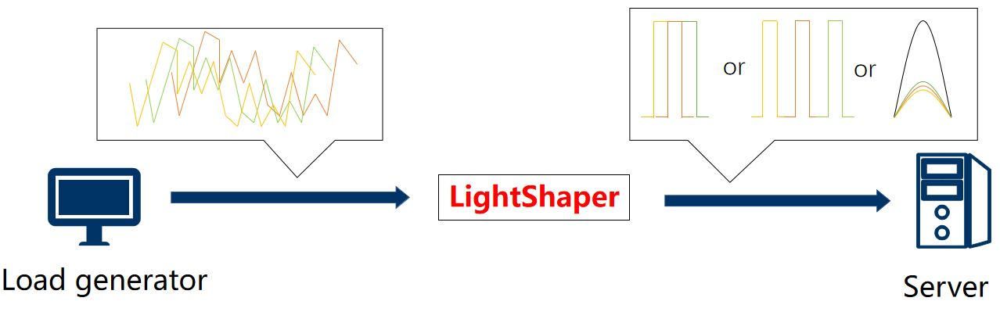

# LightShaper

 LightShaper, a pure software network traffic transformation tool in low cost based on dpdk, as an optional auxiliary the network load generator. The tool can simulate multiple network conditions by precisely controlling traffic characteristics such as traffic load rate and packet interval.In detail,LightShaper buffer and transform the irregular traffic from the workload generator , make the traffic eventually reaches the server-side with the rate or packet interval distribution that simulate the actual scene, LightShaper provide rate control,packet interval distribution control, high latency simulation, in-flow out-of-order simulation, and packet loss simulation.LightShaper enables packet interval control with microsecond accuracy. 

Architecture

 

Supported features
 - Rate control

    LightShaper uses placeholder packet filling for rate control. The granularity of the rate control is 0.01% of the line rate. 

 - Packet interval distribution control

    LightShaper supports setting the packet interval of microsecond accuracy, for example 50 microseconds. Based on the packet interval control, LightShaper provides the function of shaping the packet interval distribution image of the test load, for example, shaping the packet interval of the traffic load into a fixed interval or random distribution interval.

 - Delay simulation

    LightShaper realizes the simulation of fixed delay and random delay. In the stochastic delay, the stochastic fluctuation delay with correlation coefficient and the distributed delay conforming to the statistical distribution model are provided.

 - Out-of-order Simulation

    LightShaper implements a specified proportion of in-flow out-of-order for a specified range of streams.

 - Statistical distribution support

    LightShaper supports specific statistical distribution in terms of packet interval distribution and delay distribution.

    You can use the tool in the **tools** directory to generate a distribution model file using the distribution data and configure the model file in run.sh.

    In the **dist** directory, we provide some commonly used model files of statistical distribution, such as normal distribution, Pareto distribution, Poisson distribution with LAMDA value of 2,4, and 6, and Chi-square distribution with freedom of 6.


### Prerequisites
* libdpdk (Intel's DPDK package*, DPDK-19.04 best) 
* libnuma

### Included directories

```bash
./    
|__dist/	Distribution file,include normal distributon,pareto distribution,chi_square Distribution.etc
|__tools/   The tool for generate distributed files
```

## Installation

### DPDK intsall

```bash
$ cd <dpdk-home-path>/usertools/
$ ./dpdk-setup.sh
     - Press [38] x86_64-native-linux-gcc to compile the package
     - Press [45] Insert IGB UIO module to install the driver
     - Press [49] Setup hugepage mappings for NUMA systems to setup hugepages(20GB for each node best)
     - Press [51] Bind Ethernet/Baseband/Crypto device to IGB UIO module
     - Press [62] Exit Script to quit the tool
```

### Setup LightShaper

#### Compile
```bash
$ cd <path to LightShaper>
$ vim Makefile
  # Add two configurations at the beginning as below
  RTE_SDK= <dpdk-home-path>
  RTE_TARGET=x86_64-native-linuxapp-gcc
$ make
```

#### Run
```bash
$ ./run.sh 
```
### Release Note
### v1.0 (August 24, 2022)

In this release, we updated some of the features and added some new features, as shown below. Since "Out-of-order Simulation" and "Delayed Simulation" do not only work in L2, we have officially changed its name from  "L2shaping" to "LightShaper"

* **Rate control updated**

   In the current version, LightShaper does rate control by filling a variable-length placeholder packet.

* **Features added**

   * **Packet interval distribution control** 

   * **Delay simulation** 

   * **Out-of-order Simulation**  

   * **Statistical distribution support**

### v0.1 (April 13, 2022)
      
LightShaper V0.1 is also called L2shaping

* **Features added**

   * **Rate control by filling placeholder packet.**


### Roadmap

+ Drop simulation support
+ Detailed configuration documents
+ 40Gbps & 100Gbps support


## Acknowledgments

This work was supported by the National Key Research and Development Program of China under Grant No.  2017YFB1001602. 


## Contacts
Issue board is the preferred way to report bugs and ask questions about LightShaper or contact Zhang Wenli (zhangwl at ict.ac.cn).